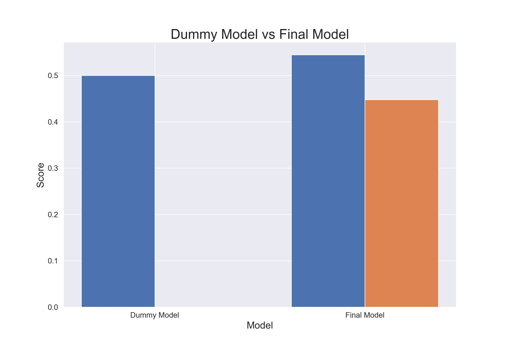
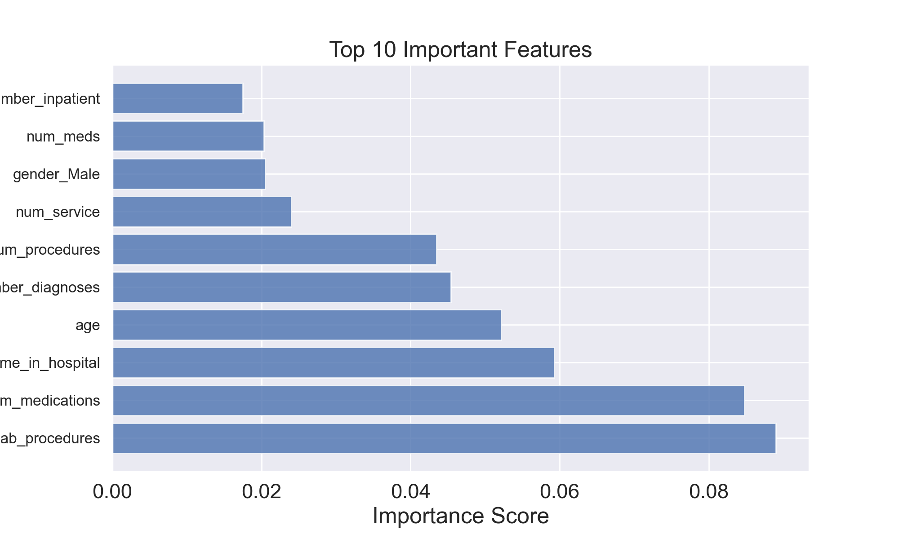
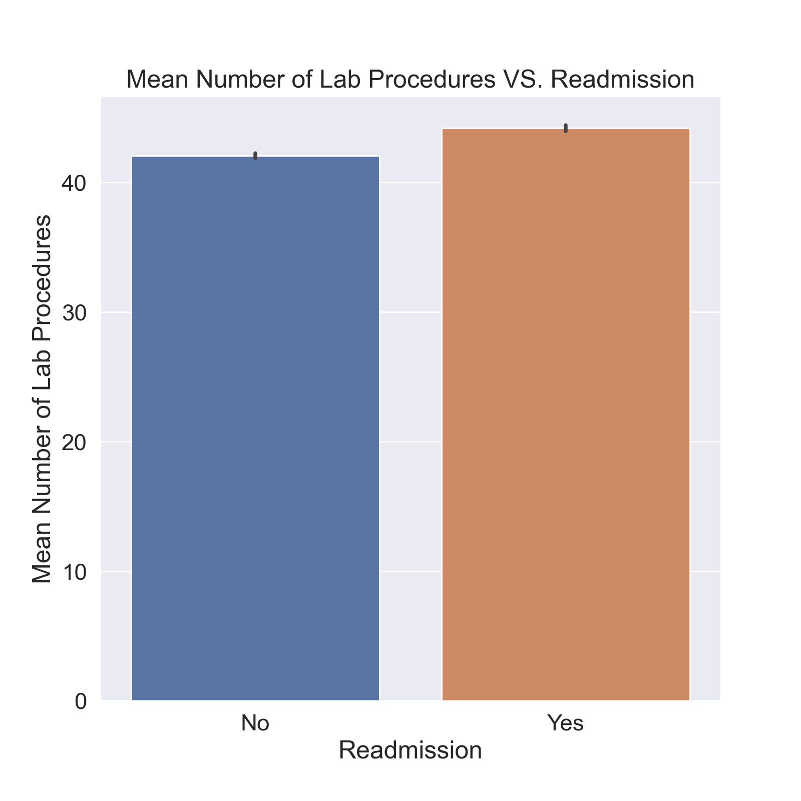
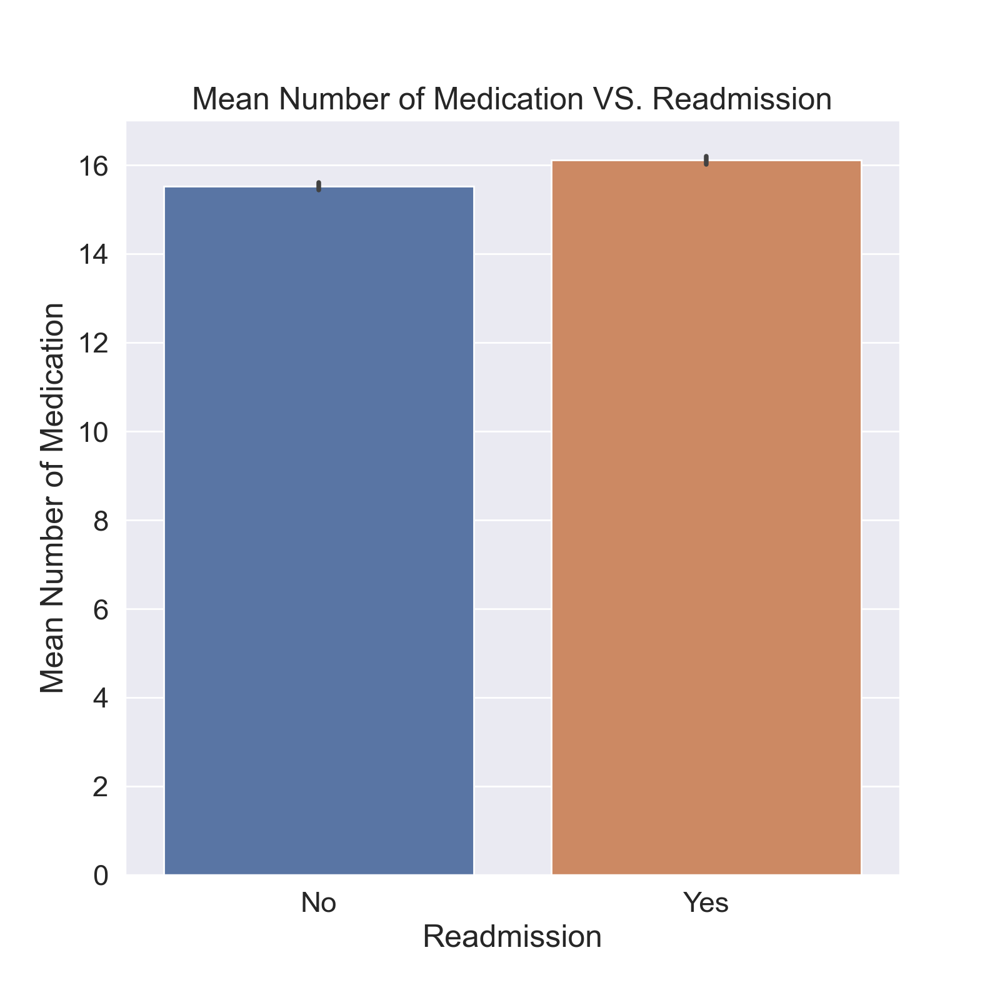

# Diabetic Hospital Readmission Classification Model

author: Alison Park


<sup>(source. https://www.google.com/url?sa=i&url=https%3A%2F%2Fnews.keckmedicine.org%2Fclinical-trial-investigating-innovative-way-to-control-type-2-diabetes%2F&psig=AOvVaw3guxc0dr4fM2r_Xn9TZ9lx&ust=1685658625681000&source=images&cd=vfe&ved=0CBIQjhxqFwoTCKDy6O7NoP8CFQAAAAAdAAAAABAJ)</sup>

## Overview
Hospital readmission for diabetic patients is a significant business problem with implications for patient outcomes and healthcare costs. In this project, a classification model was developed to predict hospital readmission for diabetic patients. The model demonstrated improvement compared to a baseline dummy model, with an increase in F1 score from 0.00 to 0.4479 and an increase in ROC AUC score from 0.5000 to 0.5449. The analysis of feature importance highlighted num_lab_procedures, num_medications, and time_in_hospital as the top influential features. These features provide valuable insights into the factors contributing to readmission risk. Future investigations could focus on feature engineering, exploring different algorithms, addressing class imbalance, and considering multi-class classification and time series analysis. By leveraging these findings, healthcare providers can tailor their policies and methodologies to improve care coordination, reduce readmission rates, and optimize patient outcomes while effectively managing healthcare resource utilization. 


## Business Understanding
Hospital readmission for diabetic patients is a significant business problem with potential implications for patient outcomes and healthcare costs. 

1. Impact on Patient Health: Hospital readmission for diabetes is associated with worse long-term outcomes for patients. Poorly controlled diabetes during the initial hospitalization can lead to complications and disease progression, including cardiovascular events, kidney problems, infections, and diabetic ketoacidosis. Inadequate management and fragmented care transitions contribute to gaps in follow-up care, medication adherence, and lifestyle management, further impacting patient health and well-being.

2. Healthcare Resource Utilization: Hospital readmissions for diabetes impose a substantial burden on the healthcare system. Repeated hospitalizations increase healthcare utilization and costs, straining healthcare resources. Additionally, fragmented care and lack of continuity disrupt the establishment of consistent and effective care plans, hindering disease management and potentially leading to avoidable readmissions.

3. Need for Comprehensive Solutions: Addressing hospital readmission for diabetic patients requires comprehensive solutions. Improving care coordination, patient education, medication management, discharge planning, and post-discharge follow-up are essential components. By focusing on these areas, healthcare providers can promote continuity of care, reduce readmission rates, improve patient outcomes, and mitigate the financial impact on the healthcare system.

In summary, hospital readmission for diabetic patients presents a significant business problem due to its impact on patient health outcomes and healthcare resource utilization. A comprehensive approach that addresses care coordination and continuity is crucial for reducing readmission rates, improving patient outcomes, and optimizing healthcare costs.

The classification model created in this project will be able to shed light on specific features included in the model that have the highest effect on readmission which hospitals can use to streamline their policies and methodologies in care coordination.


## Data Understanding

The data set represents 10 years (1999-2008) of clinical care at 130 US hospitals and integrated delivery networks. It includes over 50 features representing patient and hospital outcomes. Information was extracted from the database for encounters that satisfied the following criteria.

1. It is an inpatient encounter (a hospital admission).
2. It is a diabetic encounter, that is, one during which any kind of diabetes was entered to the system as a diagnosis.
3. The length of stay was at least 1 day and at most 14 days.
4. Laboratory tests were performed during the encounter.
5. Medications were administered during the encounter.

The target for this classification model was `readmission` and it originally started off as multiclass (no, >30, <30) but for this model, we focused on the binary problem.

There are information on the features in IDs_mapping.csv as well as the paper cited below. The IDs_mapping.csv is specifically used when binning the three features (admission_id, discharge_disposition_id, as well as admission_source).

(Beata Strack, Jonathan P. DeShazo, Chris Gennings, Juan L. Olmo, Sebastian Ventura, Krzysztof J. Cios, and John N. Clore, “Impact of HbA1c Measurement on Hospital Readmission Rates: Analysis of 70,000 Clinical Database Patient Records,” BioMed Research International, vol. 2014, Article ID 781670, 11 pages, 2014.)


## Methods

This project uses machine learning tools to make different types of models and gridsearch for hyperparameters to optimize the model.

The evaluation metric was the F1 score. The F1 score is a commonly used evaluation metric in classification tasks. It combines two important metrics: precision and recall.

Precision measures the model's ability to correctly identify positive cases (hospital readmissions) out of all instances predicted as positive. In the context of hospital readmission, precision represents the proportion of patients predicted as readmitted who are actually readmitted. A high precision indicates that when the model predicts a patient will be readmitted, it is likely to be correct.

Recall, on the other hand, measures the model's ability to correctly identify all positive cases (actual hospital readmissions) out of the total actual positive cases. In the context of hospital readmission, recall represents the proportion of actual readmissions that the model correctly identifies. A high recall indicates that the model is effective at capturing a significant portion of the readmissions.

The F1 score combines precision and recall into a single metric, providing a balanced measure of the model's performance. It considers both false positives and false negatives, which is important in healthcare applications where the consequences of misclassification can be significant. By optimizing for the F1 score, we aim to strike a balance between identifying as many true positives (correctly predicting readmissions) as possible while minimizing false positives and false negatives.

In summary, the F1 score is a useful evaluation metric in the context of hospital readmission prediction because it considers both precision and recall, providing a balanced assessment of the model's ability to identify readmissions while minimizing false predictions.


## Final Model

The final model was created using the third grid search for the random forest model as the final model. This model had a f1 score of 0.4479. 



This shows the dummy model, model that purely guesses the most frequent (no readmission), compared to the final model. As you can both the f1 score and ROC AUC scores increased with our final model which means that this model will be more precise when predicing which patients are likely to get readmitted.


## Interpretation of Model



This graph shows the top 10 key features which show the features that have the highest influence on the target variable in a machine learning model. The importance of features is determined by analyzing their contribution to the model's predictive performance.





The analysis of feature importance reveals that num_lab_procedures, num_medications, and time_in_hospital are the most influential factors in predicting readmission for diabetic patients. These features indicate the number of laboratory procedures, medications administered, and duration of hospital stay, respectively. A higher number of lab procedures and medications, as well as a longer hospital stay, are associated with an increased likelihood of readmission.

By recognizing the significance of these features, hospitals and healthcare providers can customize their care coordination strategies, discharge planning, and post-discharge follow-up to cater to the specific needs of diabetic patients. This targeted approach aims to enhance patient outcomes, lower readmission rates, and optimize the utilization of healthcare resources.


## Conclusions

Hospital readmission for diabetic patients is a significant business problem with potential implications for patient outcomes and healthcare costs. It is well-established that hospital readmissions for diabetes are associated with worse long-term health outcomes for patients. Poorly controlled diabetes during the initial hospitalization can lead to complications and disease progression, including cardiovascular events, kidney problems, infections, and diabetic ketoacidosis. Inadequate management and fragmented care transitions contribute to gaps in follow-up care, medication adherence, and lifestyle management, further impacting patient health and well-being.

From a healthcare resource perspective, hospital readmissions for diabetes impose a substantial burden on the healthcare system. Repeated hospitalizations increase healthcare utilization and costs, straining healthcare resources that could be better allocated to other areas of need. Additionally, fragmented care and lack of continuity disrupt the establishment of consistent and effective care plans, hindering disease management and potentially leading to avoidable readmissions.

Addressing hospital readmission for diabetic patients requires comprehensive solutions that go beyond the scope of a single intervention. Improving care coordination, patient education, medication management, discharge planning, and post-discharge follow-up are all essential components. By focusing on these areas, healthcare providers can promote continuity of care, reduce readmission rates, improve patient outcomes, and mitigate the financial impact on the healthcare system.

In the context of my classification model for predicting hospital readmission, the analysis of feature importance provides valuable insights into the factors that contribute most significantly to the prediction. In this case, the top three important features are num_lab_procedures, num_medications, and time_in_hospital. The high importance assigned to these features suggests that they have a strong influence on the likelihood of readmission for diabetic patients.

The num_lab_procedures feature indicates that the number of laboratory procedures performed during a patient's encounter plays a crucial role in predicting readmission. A higher number of laboratory procedures may signify a more severe or complex medical condition, which increases the likelihood of readmission. Similarly, patients who require a larger number of medications may have more complex health conditions or ongoing treatment needs, increasing the chances of readmission. Lastly, the time_in_hospital feature reflects the duration of a patient's stay. A longer hospital stay often indicates a more severe or complicated case, thus raising the likelihood of readmission.

By understanding these important features, hospitals and healthcare providers can tailor their policies and methodologies in care coordination, discharge planning, and post-discharge follow-up to address the specific needs of diabetic patients. This targeted approach can help improve patient outcomes, reduce readmission rates, and optimize healthcare resource utilization.

In conclusion, hospital readmission for diabetic patients is a pressing business problem with significant implications for patient health outcomes and healthcare costs. The analysis of the Random Forest model has shed light on the key features that influence readmission prediction, providing actionable insights for hospitals to streamline their policies and methodologies in care coordination. By leveraging these insights and implementing comprehensive solutions, healthcare providers can work towards improving the lives of diabetic patients, reducing readmission rates, and optimizing healthcare resource utilization.


## Next Steps

In order to enhance the model's performance in predicting hospital readmission for diabetic patients, several avenues for future investigation can be explored.

1. Feature Engineering: Further refinement of the feature set can be undertaken to capture more relevant information. This may involve considering additional variables or deriving new features from the existing ones. For example, incorporating patient demographics, socioeconomic factors, comorbidities, or specific diabetes-related indicators could provide valuable insights into readmission risk.

2. Algorithm Exploration: Experimenting with different machine learning algorithms or ensemble techniques may offer alternative modeling approaches. Different algorithms may have varying strengths and weaknesses, and exploring their applicability to the problem at hand can help identify the most suitable model for improved performance.

3. Threshold Adjustment: Adjusting the classification threshold of the model can influence the trade-off between precision and recall. Fine-tuning the threshold to optimize the desired outcome, such as maximizing the identification of patients likely to be readmitted, can enhance the model's effectiveness in capturing positive cases.

4. Addressing Class Imbalance: Considering the class imbalance issue in the dataset is crucial for achieving a well-calibrated model. Techniques such as oversampling the minority class (readmitted patients) or undersampling the majority class (non-readmitted patients) can be employed to balance the dataset, potentially improving recall and overall model performance.

5. Multi-Class Classification: Exploring a multi-class classification approach, where patients are classified into "No Readmission," "Readmission within 30 days," or "Readmission after 30 days," can provide a more nuanced understanding of readmission risk. This information can guide the implementation of targeted policies and interventions, focusing on individuals with a higher likelihood of readmission in the near future.

6. Time Series Analysis: Implementing time series models to track and analyze patients' glucose serum levels and A1C levels can provide valuable insights into their diabetic management. Regular monitoring of these indicators is essential for assessing patients' glycemic control and overall health status. By incorporating time series analysis into the predictive model, it is possible to leverage longitudinal data to identify patterns, trends, and potential risk factors for readmission.

7. Data Collection: Gathering additional data can be beneficial for improving model performance. More data not only increases the sample size but also allows for a better representation of the underlying population. Obtaining a larger and more diverse dataset can help capture a wider range of patient characteristics, contextual factors, and clinical outcomes, thereby enhancing the model's generalization ability.

By undertaking these future investigations, the understanding of hospital readmission for diabetic patients can be further refined, leading to more accurate predictions and actionable insights for healthcare providers.

To improve the robustness of our model, we recommend exploring alternative machine learning algorithms such as XGBoost or conducting further grid searches on the random forest model to identify the optimal categorical model. This would enable us to identify more accurate features to target for future hospital policies.

Overall, the results of our study suggest that additional research is necessary to further refine the model's precision and predictive ability, and to ensure that it can be effectively applied in real-world settings.

## For Inquiries, Business Proposals, or Additional Information...

Our process is available in this [Jupyter Notebook](./final_notebook.ipynb) or abbreviated in this 
[presentation](./DIABETES_Hospital Readmission_AlisonPark_ppt.pdf).

We can be contacted via email at [alisonsjpark@gmail.com \(Alison\)](mailto:alisonsjpark@gmail.com) 


## Repository structure

```
├── data
│   ├── diabetic_data.csv
│   └── IDs_mapping.csv
├── paper
│   └── Impact of HbA1c Measurement on Hospital Readmission Rates- Analysis of 70,000 Clinical Database Patient Records.pdf
├── images
│   ├── diabetes.jpeg
│   ├── dummy_vs_final.png
│   ├── num_lab_procedures.png
│   ├── num_medications.png
│   └── top_10_features.png
├── scratch_notebooks
│   ├── initial_notebook.ipynb
│   └── scratch_notebook 67.ipynb
├── .gitignore
├── final_notebook.ipynb
├── LICENSE
├── DIABETES_Hospital Readmission_AlisonPark_ppt.pdf
└── README.md
```


